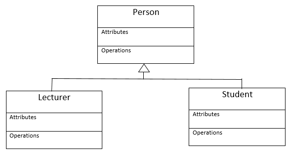

<<<<<<< HEAD
# ThreatMap - Sistem de Vizualizare și Analiză a Amenințărilor Cibernetice


ThreatMap este o aplicație desktop pentru vizualizarea și analiza amenințărilor cibernetice bazate pe adrese IP. Sistemul integrează un backend robust în Java cu Spring Boot pentru procesarea log-urilor și detectarea atacurilor, și un frontend interactiv cu Electron și React pentru reprezentarea grafică 3D. Proiectul demonstrează aplicarea tehnicilor de securitate cibernetică, geolocație și inteligență artificială în analiza datelor de log.


## Caracteristici Principale

- **Hartă 3D Interactivă**: Reprezentare geografică a atacurilor pe un glob terestru, utilizând biblioteci de randare 3D.
- **Detectare Automată a Atacurilor**: Algoritmi de analiză pentru identificarea pattern-urilor de atac, inclusiv brute-force și DDoS.
- **Analiză IP Avansată**: Geolocație precisă, detectare VPN și informații despre furnizori de internet.
- **Integrare AI**: Evaluare a riscurilor utilizând modele de inteligență artificială pentru clasificare.
- **Interfață Utilizator Modernă**: Dashboard cu statistici în timp real și controale pentru configurare.
- **Performanță Optimizată**: Caching în memorie și procesare asincronă pentru gestionarea eficientă a datelor mari.

## Arhitectură și Funcționalitate

ThreatMap e împărțit în două părți magice:

### Backend (Creierul)
- **Java + Spring Boot**: Procesează log-uri, detectează pattern-uri suspecte.
- **AI Integration**: Conectează la OpenRouter pentru evaluări inteligente.
- **Geolocație**: MaxMind pentru locații offline, API-uri pentru backup.
- **API REST**: Endpoint-uri pentru frontend să ia date.

### Frontend (Interfața)
- **Electron + React**: Aplicație desktop cu UI modernă.
- **Three.js + Mapbox**: Hartă 3D cu glob rotativ și markere interactive.
- **Tailwind CSS**: Design curat, responsive și dark mode-ready.

Fluxul: Log → Backend → Analiză → Date → Frontend → Hartă 3D ✨

## Instalare

```bash
# 1. Clonează proiectul
git clone https://github.com/tu-utilizator/ThreatMap.git
cd ThreatMap

# 2. Backend setup
cd backend/src
mvn clean install
# Pune GeoLite2-City.mmdb în src/main/resources/ (opțional)

# 3. Frontend setup
cd ../../frontend/electron-vite-react
npm install

# 4. Rulează totul
# Terminal 1: cd backend/src && mvn spring-boot:run
# Terminal 2: npm run dev
```

## Utilizare

- **Dashboard**: Încarcă log-uri, vezi harta și statistici.
- **Statistics**: Grafice detaliate despre atacuri.
- **Settings**: Configurează API-uri și praguri de detectare.
- **Tips**: Încearcă cu log-uri de test din folderul `logs/`.

## API-uri


| Endpoint | Descriere | Exemplu |
|----------|-----------|---------|
| `GET /api/process` | Procesează log | `?filePath=logs/example.log` |
| `POST /api/process` | Încarcă fișier | Multipart file |
| `GET /api/attacks` | Atacuri recente | JSON cu locații |
| `GET /api/stats/ai-risk` | Risc AI | `{"dangerPercent": 75}` |

## Structura Proiectului

```
ThreatMap/
├── backend/                    # 🧠 Server Java
│   └── src/main/java/com/proiect/
│       ├── controller/         # API endpoints
│       ├── service/            # Logic de detectare
│       └── model/              # Date (AttackEvent, etc.)
├── frontend/                   # 💻 Aplicație desktop
│   └── electron-vite-react/
│       ├── src/
│       │   ├── components/     # MapBox3D, AttackFeed
│       │   ├── pages/          # Dashboard, Statistics
│       │   └── hooks/          # useAiRisk, etc.
│       └── electron/           # Main & preload
└── README.md                   # Acest fișier 😎
```
=======
# Titlu proiect
### Student(i)

## Descriere
Lorem ipsum dolor sit amet, consectetur adipiscing elit, sed do eiusmod tempor incididunt ut labore et dolore magna aliqua. Ut enim ad minim veniam, quis nostrud exercitation ullamco laboris nisi ut aliquip ex ea commodo consequat. Duis aute irure dolor in reprehenderit in voluptate velit esse cillum dolore eu fugiat nulla pariatur. Excepteur sint occaecat cupidatat non proident, sunt in culpa qui officia deserunt mollit anim id est laborum

## Obiective
Lorem ipsum

* ob1
* ob2
* ob3
    - sob31
    - sob32
    - ...
* ....

## Arhitectura
Lorem ipsum ...



Lorem ipsum ...

## Functionalitati/Exemple utilizare
Lorem ipsum

### Resurse
Markdown Guide, [Online] Available: https://www.markdownguide.org/basic-syntax/ [accesed: Mar 14, 1706]
>>>>>>> 28dba3a519103c2ed3ba081c2c801fd0de6d254f
